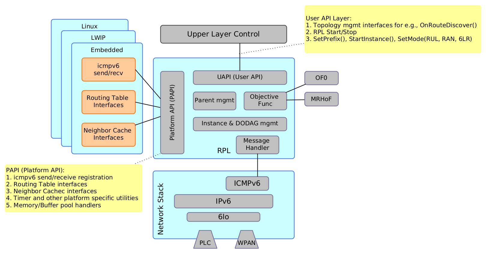

# Tripple - RPL routing protocol implementation

[RPL](https://tools.ietf.org/html/rfc6550)(pronounced ripple) is a routing protocol standardized in IETF for Low-Power and Lossy Networks. This implementation aims to work consistently across, Linux, LWIP and other embedded OS.

The primary mission is to ensure most optimal network overhead with tunable parameters towards RPL performance. The implementation will use latest RPL extensions (deemed RPLv2) for its handling.

The aim also is to produce a feature-rich implementation which could be used on relatively non-constrained environments, however, still be more resource optimal as compared to other routing protocols.

|         Features        |  Description | Target Phase |
|-------------------------|--------------|--------------|
| Non-storing MOP | Basic requirement. Support for optimized [6LoRH](https://tools.ietf.org/html/rfc8138) for reduced routing header control overhead | P1 |
| Storing MOP | Basic requirement. Supporting optimized routing table, prefix table for lower RAM utilization. | P1 |
| Loop detection and avoidance | Handling of RPI for loops detection/avoidance | P1 |
| Multiple instances | Support multiple instances with different objective functions | P2 |
| Multiple DODAGs per instance | For optimal load balancing using multi-BR solution [details](http://blog.rjed.org/rpl/2019/06/15/rpl_multi_instances_vs_multi_dodags/) | P2 |
| Support for multiple prefixes | Basic Requirement | P1 |
| Improved Route Invalidation | Results in lower stale routes in the network. Also reduces route invalidation control overhead. [Details](https://github.com/nyrahul/ietf-data/blob/master/DCO_performance_report.md) | P1 |
| Objective Functions | Plugin based objective function support. OF0 and OF1(MRHOF) to be supported. | P1 |
| Ability for routers to disable joining | This would result in more balanced networks. Nodes would respect upstream routers resource constraints. [Details](https://datatracker.ietf.org/doc/draft-ietf-roll-enrollment-priority/) | P2 |
| Topology mgmt interfaces | APIs to export events like node join/remove/path-switch/metric-change. A BR would be able to plot a graph based network for monitoring purpose based on this exported metadata | P1 |
| Multiple interfaces support | Ability to use multiple link layer interfaces | P1 |
| Rich metrics support | Ability to use metric information (LQI, RSSI, other L2 feedback) exported from link-layer | P1 (extn in P2) |
| Capabilities support | Runtime detection of nodes capabilities | P3 |
| Balanced networks | Support for more balanced networks resulting in better energy utilization and increased network lifetimes | P3 |
| Multicast support | Optimized multicast address advertisement support | P3 |
| Target aggregation | Sending multiple targets in DAO to reduce control overhead | P3 |
| Adjacency Probing | To check if the preferred parents are still available in case of sparse traffic | P3 |
| Reduced DIO control overhead | Reducing control options in DIO such as Configuration Option, Prefix Option and using a sequence counter to check the version | P3 |

| Advanced Features | Description | Target Phase |
|-------------------|-------------|--------------|
| Multipath routing | Support for multiple preferred parents and load balancing of data traffic | P3 |
| AODV-RPL | Improved P2P support | P4 |
| Support for RULs | RPL Unaware leaves could be very resource-constrained leaf nodes | P4 |
| Support for IPv4 | Supporting IPv4 based RPL | P4 |
| Hybrid storing, non-storing RPL instances | Support for DAO projection | P4 |
| Support for 6LoRH | Reduced data plane control overhead by compressing SRH and RPI headers | P4 |
| Support for GHC | Generic header compression for reduced control overhead | P4 |

| Framework Features | Description |
|-------------------------|--------------|
| Integrate with Linux, LWIP, Embedded OSes | |
| Improved RAM handling | Decoupling routing table and prefix table. |
| Realistic testing | Benchmarks based on [Whitefield](https://github.com/whitefield-framework/whitefield) simulation |

